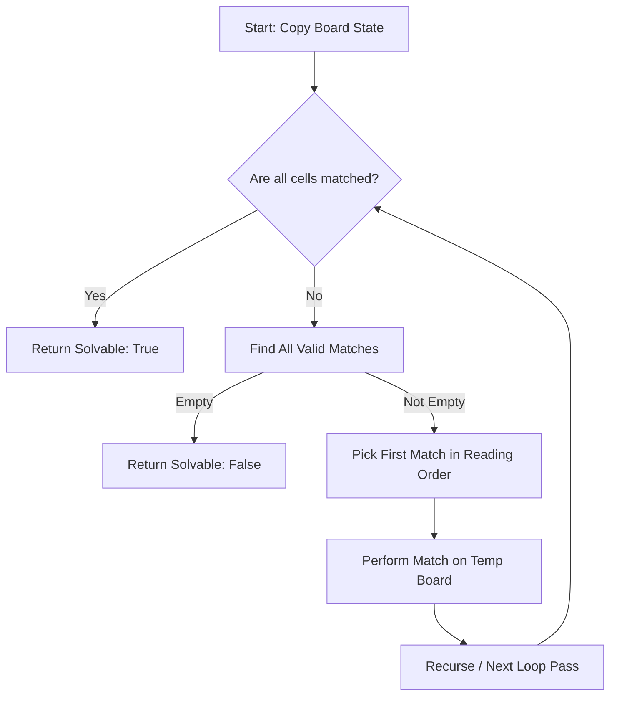

# SumLink Game Engine — Comprehensive Algorithm & Design Specification (v5)

This document provides a comprehensive breakdown of the core algorithms and systems powering both the **Web (TypeScript/JavaScript)** and **Android (Java)** implementations of SumLink.

---

## 1. The Matching & Path Check Engine

Every action on the grid is governed by the match-validation check. When the player selects two cells ($A$ and $B$, with indices $i_A < i_B$ in the flat board representation), the engine runs a 3-step check.

### Step 1: The Value Check
Before checking physical paths, the engine checks basic mathematical rules:
1. **Identical Match:** $V_A == V_B$ (e.g., matching $3$ and $3$).
2. **Sum-to-Ten Match:** $V_A + V_B == 10$ (e.g., matching $3$ and $7$).
If neither is true, the match is immediately rejected.

### Step 2: The Path Check
If values are compatible, the engine checks if the physical path between them is clear. **All matched (inactive) cells along the path are treated as empty air and skipped.** The engine checks paths in this strict order:

1. **Horizontal Check:** 
   - True if both cells are in the same grid row: $\lfloor i_A / 9 \rfloor == \lfloor i_B / 9 \rfloor$.
   - The path is clear if all cells $i$ where $i_A < i < i_B$ are matched (`m == true`).
2. **Vertical Check:**
   - True if both cells are in the same grid column: $i_A \pmod 9 == i_B \pmod 9$.
   - The path is clear if all cells $i$ where $i = i_A + 9k$ (for integer $k \ge 1$) up to $i_B$ are matched (`m == true`).
3. **Diagonal Check:**
   - True if the cells form a perfect diagonal: $|\text{row}_A - \text{row}_B| == |\text{col}_A - \text{col}_B|$.
   - The path is clear if all diagonal slots between them are matched.
4. **Wrapping (Reading Order) Check:**
   - True if there are no unmatched (active) cells between $i_A$ and $i_B$ in the flat array order.
   - The path is clear if every single cell $i$ where $i_A < i < i_B$ is matched (`m == true`), even if they wrap across multiple rows.

---

## 2. Board Generation & Seeder

SumLink avoids pure random shuffling (which leads to trivially clustered matches) in favor of **Layered, Gap-Enforced Seeding**.

### Layered Generation Flow
For any level $L$, the configuration yields a `matchDensity`, `minGap`, and `maxGap`.
1. **Layer 1 — Pinned Match:** To prevent starting deadlocks, the first pair is always same-value and pinned directly at indices `[0, 1]`.
2. **Layer 2 — Strategic Pairs:** Pairs are placed using a gap-enforced algorithm:
   - For each pair, the index distance $g = |i_B - i_A|$ must satisfy: $\text{minGap} \le g \le \text{maxGap}$.
   - Pushing pairs further apart at higher levels increases the physical scan distance, raising cognitive search difficulty.
3. **Layer 3 — True Decoys:** Remaining slots are filled with **true decoys**—numbers $D$ whose complement $10-D$ does not exist in any other cell on the board, ensuring they can never be accidentally matched.

### Level 1 Curated Templates
To guarantee a gentle onboarding experience, Level 1 uses curated 27-element (3-row) templates (e.g. `[1, 1, 2, 2, 3, 3, 4, 4, 5, 5, 6, 6, 7, 7, 8, 8, 9, 9, 1, 1, 2, 2, 3, 3, 4, 4, 5]`) that are mapped to randomized values and spatially mirrored, guaranteeing 100% adjacent onboarding pairs.

### Seed Validation Metrics
Every board generated is validated against:
- **Solvability:** Verified by simulating the board clearing.
- **Match Density:** The proportion of active cells participating in immediate matches must fall within strict tolerances.

---

## 3. The Solvability Solver (Backtracking Simulation)

To guarantee that no level starts in an impossible state and that Add Row additions maintain a solvable game, the engine runs a **Backtracking Simulation Solver**:



If the simulated game successfully reduces the active cell count to 0, the board is flagged as **solvable**. If it runs out of matches while active cells remain, it is rejected.

---

## 4. Scan & Confirm Interception

To prevent accidental "Add Row" button presses while matches remain, the game intercepts clicks using a scanning state machine:

1. **State Pause:** Clicking "Add Row" locks user grid interactions and changes the button text to `"🔍 Scanning..."`.
2. **Pulse Animation:** Active cells pulse visually to represent the background scan.
3. **Search Check:** The engine calls `findAllMatches()`.
   - **Case A: No matches exist.** The game immediately appends the new row.
   - **Case B: Matches found.** The game displays a confirmation warning ("Matches Available!").
     - **Reading Order Highlight:** The first match in reading order is highlighted on the grid.
     - **Cancel / Keep Looking:** The warning is dismissed, grid highlights are cleared, and no cells are added.
     - **Yes / Add Row:** The warning is dismissed, grid highlights are cleared, and the new row is added.

---

## 5. Intelligent Minimal Add Row Engine

The Add Row algorithm is optimized to keep the game fair and avoid artificially increasing board height near the end of a level.

```
                  Board Add Row Triggered
                            │
               Is board close to completion?
               (active cells <= 9) or (1 complement needed)
               ┌────────────┴────────────┐
              YES                        NO
               │                         │
     [Complements Only]          [Padded Row Mode]
       Generate minimal            Generate minimal
      rescue complements          rescue complements
               │                         │
               │                   Pad with active
               │                 pairs to 9 cells
               │                         │
               └────────────┬────────────┘
                            │
               Pad remainder of the 9-cell
               row with MATCHED placeholders
                            │
                 Append to grid layout
```

### Classification
Active cells are scanned and sorted:
- **Stranded Cells:** Cells with no current valid match path to any partner.
- **Orphan Cells:** Cells whose value and complement are unique on the board.

### Cascading Complements
The engine generates the complements of the stranded cells in **reversed index order**.
*Why reversed?* Because placing the complement of the last cell first ensures that it sits adjacent to the board's last cell, triggering a guaranteed match. As that match clears, it opens up a gap, allowing the next complement to reach its partner in a cascading chain.

### Padding Rules
1. **Standard Mode:** If the board is large and multiple matches are needed, the complement row is padded to exactly 9 active cells using complement pairs of existing active values to keep the game going.
2. **Close to Completion Mode:** If there are $\le 9$ active cells remaining or only 1 complement is needed, the engine generates **only** the required complements. The rest of the 9-column row is filled with matched placeholder cells (`m: true`), keeping the layout aligned without adding unwanted numbers.
